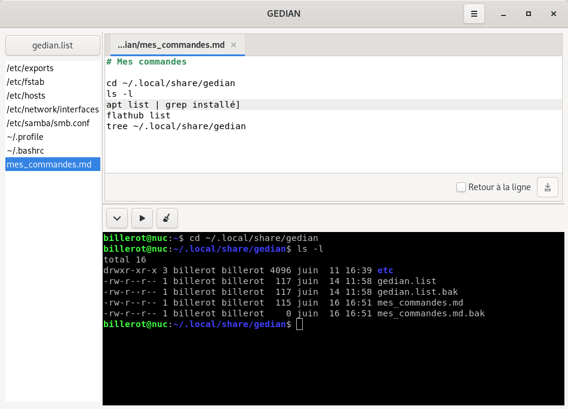

# GEDIAN

Editeur des fichiers d'un système DEBIAN

## INSTALLATION

- cd [votre répertoire des applications]
- git clone https://github.com/pbillerot/gedian.git
- cd gedian
- python3 gedian.py -h
```
usage: gedian.py [-h] [-install] [-directory DIRECTORY]

optional arguments:
  -h, --help            show this help message and exit
  -install              Installation de gedian.desktop dans Gnome
  -directory DIRECTORY  Répertoire de GEDIAN (~/local/share/gedian par défaut)
```
- python3 gedian.py -install

## DEMARRAGE

- python3 [repertoire installation]/gedian.py


## UTILISATION

L'interface de GEDIAN propose 3 blocs :

- la liste des fichiers que vous voulez gérer (gedian.list)
- l'éditeur de fichier texte avec onglet
- le terminal émulateur du shell

## La liste des fichiers

La liste des fichiers est maintenue dans le fichier ```~/.local/share/gedian/debian.list``` par défaut.

L'option [-directory DIRECTORY] permet de changer le répertoire de GEDIAN

Cette liste est modifiable via le bouton [debian.list]


## L'éditeur de fichier texte

L'éditeur est un dérivé de l'éditeur GTKSourceView de Gnome avec le coloriage syntaxique (_si le type de fichier est identifiable_)

Le bouton [Enregistrer] ou (Ctrl+S) va dérouler les opérations suivantes :
- backup du fichier (en.bak) avant les modifications
- enregistrement du fichier modifié dans le répertoire de GEDIAN (_en conservant l'arborescence des répertoires_)
- et enfin, enregistrement du fichier à son endroit

Nous retrouverons sous GEDIAN l'ensemble des fichiers modifiés avec leur backup :
```
/home/billerot/.local/share/gedian
├── etc
│   ├── exports
│   ├── exports.bak
│   └── samba
│       ├── smb.conf
│       └── smb.conf.bak
├── gedian.list
├── gedian.list.bak
├── mes_commandes.md
└── mes_commandes.md.bak
```
> À noter que le mot de passe de l'administrateur sera demandé si l'utilisateur connecté n'a pas les droits d'écriture sur le fichier ou répertoire.

## Le terminal

Le terminal est un dérivé du VTE Terminal de Gnome



Fonctions des 3 boutons de la barre d'outils :

[v] permet de recopier la ligne courante de l'éditeur dans le terminal (_le curseur de l'éditeur va se déplacer sur la ligne suivante, ce qui permettra d'enchaîner les commandes dans le terminal_)

[>] va générer une validation de la commande dans le terminal

[x] va nettoyer la fenêtre du terminal (_commande clear_)
